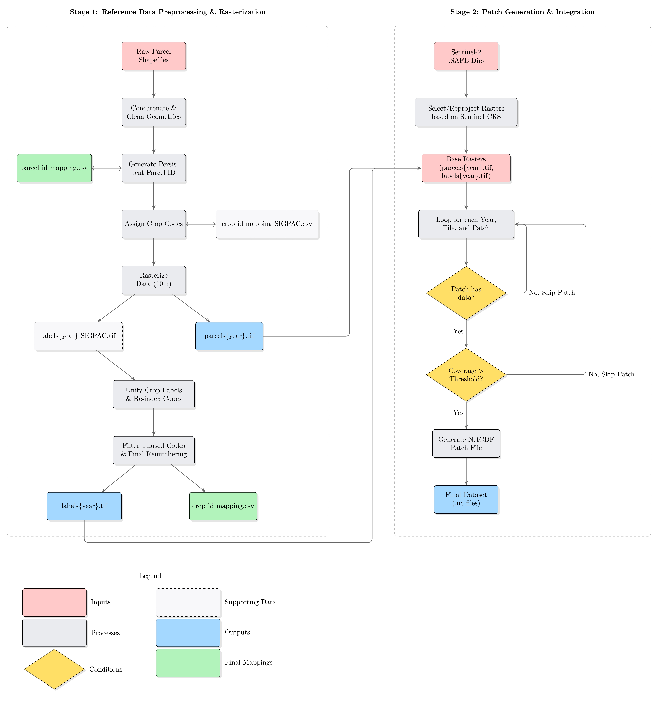
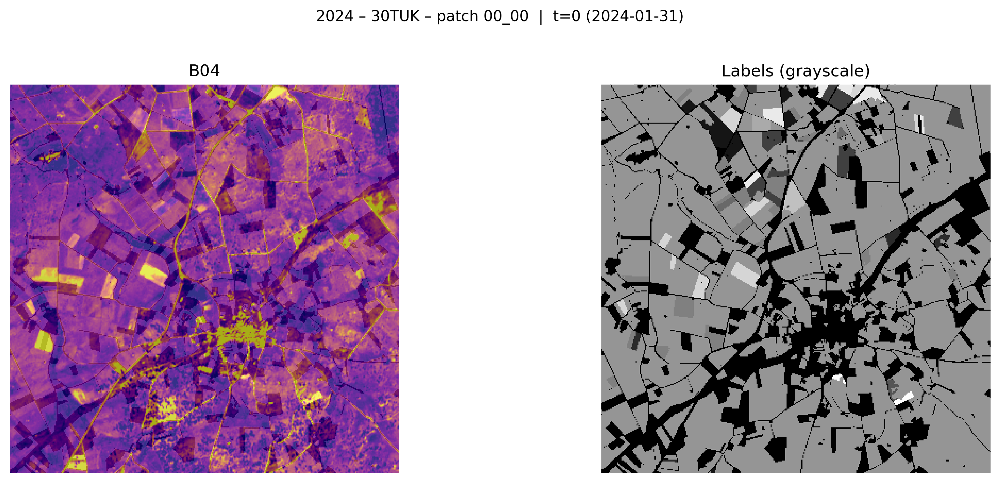

<!-- --------------------------------------------------------------------- -->
<!--         S4A-CyL – Sentinel-2 for Agriculture         -->
<!-- --------------------------------------------------------------------- -->
<p align="center">
  
  
  
  
  <a href="https://hdl.handle.net/10259/10551"></a>
</p>

<h1 align="center">S4A-CyL Dataset Creation</h1>
<p align="center"><em>Sentinel-2 time-series dataset with parcel-level crop labels for Castilla y León (Spain, 2020–2024)</em></p>

<!-- ===================================================================== -->
<!--                         Diagrama del Proyecto                         -->
<!-- ===================================================================== -->
<p align="center">
  <!-- 
    INSTRUCCIÓN: 
    1. Convierte tu PDF del diagrama a una imagen (p. ej., 'diagrama_s4a-cyl.png').
    2. Sube esa imagen a la carpeta raíz de tu repositorio.
    3. La imagen aparecerá automáticamente aquí. 
  -->
  
</p>

---

## Why this repository?

* **Explore quickly** – open any NetCDF patch in a couple of lines of Python or in the provided Jupyter notebook.  
* **Query with confidence** – utility functions to extract time-series, masks, parcel footprints, class names, etc.  
* **Extend if needed** – all preprocessing scripts are here, but they require the *official* SIGPAC shapefiles which are **not distributed in this repo** (see § Data prerequisites).

> **TL;DR** > If you only need to *use* the published dataset, clone the repo and jump straight to the notebook.  
> If you want to **re-generate** the raster layers or add future years, bring your own SIGPAC files and follow the full workflow.

---

## Table of Contents
- [Quick start](#quick-start)
- [Examples](#examples)
- [How to cite](#how-to-cite)
- [License](#license)

---

## Quick start

```bash
# 1. clone and enter
git clone [https://github.com/RodrigoPascual/S4A-CyL.git](https://github.com/RodrigoPascual/S4A-CyL.git)
cd S4A-CyL

# 2. create the conda env
conda env create -f environment.yml
conda activate s4acyl

# 3. download patches (≈ MB) from [https://hdl.handle.net/10259/10551](https://hdl.handle.net/10259/10551)

# 4. explore!
jupyter lab notebooks/patch_visualization.ipynb
```

## Data Structure

The S4A-CyL dataset is distributed as a collection of NetCDF (`.nc`) files. Each file, or "patch," is self-describing and contains multi-resolution time series data and the corresponding reference layers.

For a detailed breakdown of the hierarchical structure, including global attributes, dimensions, groups, and variables for a sample patch, please refer to the following file:

* **[NetCDF Patch Hierarchical Structure](NetCDF_patches_hierarchical_structure.txt)**


## Examples

| Patch · Band · Overlay | Imagen |
|-------------------------|--------|
| **2024_30TUK_patch_00_00** – Band B04 + Labels (grayscale) |  |
| **2024_30TUM_patch_00_16** – RGB + Parcels (grayscale)  |  |
| **2020_29TPF_patch_20_15** – RGB + Labels (vidris) + legend |  |
| **2024_30TUM_patch_20_15** – RGB + Labels (color) + legend|  |

